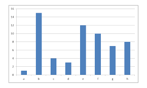

# **📜 PDF to text( ASCII for graphics), Compression & Analysis Tool**  

## **🚀 Project Overview**  
This project automates the process of:  
1. **Extracting text from PDFs** and converting images into **ASCII art**.  
2. **Compressing the extracted text** using **GZIP, BZ2, and ZLIB** to compare efficiency.  
3. **Analyzing compression results** by **visualizing compression ratios** in a bar chart.  

### **💡 Why This Project?**  
- PDFs contain a lot of valuable information but can be hard to process.  
- This tool **extracts text and converts images to ASCII** to make it more accessible.  
- Compression helps **reduce file size** for storage or transmission.  
- **Visualization** helps compare which compression method works best!  

---

## **📂 Project Structure**  

```
.
├── data/                          # Stores extracted text & compressed files
│   ├── Sample.pdf                 # Example PDF file
│   ├── Sample.txt                 # Extracted text
│   ├── Sample_gzip.txt            # GZIP compressed text
│   ├── Sample_bz2.txt             # BZ2 compressed text
│   ├── Sample_zlib.txt            # ZLIB compressed text
├── main.py                        # Main script (GUI + Processing)
├── README.md                      # Project Documentation
└── requirements.txt                # Required dependencies
```

---

## **🖥️ Features**  
✔ **GUI Interface** – No coding needed! Just select a file and run.  
✔ **Live Progress Updates** – Status messages show extraction, compression, and analysis progress.  
✔ **Multi-threading** – Keeps the UI responsive while processing.  
✔ **Automatic Text Extraction** – Extracts text and ASCII images from PDF.  
✔ **Compression Comparison** – Uses **GZIP, BZ2, and ZLIB**.  
✔ **Analysis Graph** – Shows **compression efficiency** in a **visual format**.  

---

## **🎯 How to Run the Project**
### **1️⃣ Install Dependencies**
Run the following command to install all required libraries:  
```bash
pip install pymupdf pillow tk matplotlib
```

### **2️⃣ Start the GUI**
Simply run:  
```bash
python main.py
```

### **3️⃣ Steps in the GUI**
1. **Select a PDF file** 📂  
2. **Click "Extract Text"** – Extracts text and converts images to ASCII 🎨  
3. **Click "Compress Text"** – Compresses extracted text using GZIP, BZ2, and ZLIB 📦  
4. **Click "Show Analysis"** – Displays a **bar chart** comparing compression efficiency 📊  

---

## **📊 Understanding the Results**
- **Compression Ratio** = (Compressed File Size) / (Original File Size)  
- **Lower compression ratio = Better compression efficiency** ✅  
- **GZIP, BZ2, and ZLIB** have different trade-offs:  
  - **BZ2** provides the best compression but is slower.  
  - **ZLIB** is faster but may not compress as well.  
  - **GZIP** is a good balance between speed and compression.  

### **📈 Sample Analysis Graph**
When you click **"Show Analysis"**, the tool generates a **bar chart** like this:  
  
(*Example bar chart for reference*)  

---

## **💡 Use Cases**
🔹 **Data Processing** – Extract text from large PDFs for further analysis.  
🔹 **Storage Optimization** – Compress large text files to save space.  
🔹 **Data Transmission** – Reduce file sizes for faster network transfer.  
🔹 **AI & NLP** – Use extracted text for natural language processing.  

---

## **📌 Future Enhancements**
- [ ] Support for **batch processing** multiple PDFs at once.  
- [ ] More **compression methods** like LZMA.  
- [ ] **Save analysis reports** as PNG or CSV.  

---

## **📜 License**
This project is open-source under the **MIT License**.  


